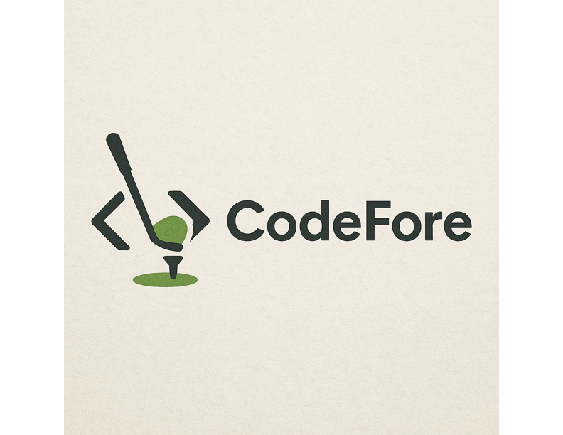

## CodeFore Solutions

## Description
At CodeFore, we build high-performing websites with the precision of a perfect swing. We blend clean front-end design with custom backend development to help brands win online.

## Table of Contents
- [Installation](#installation)
- [Usage](#usage)
- [Contributing](#contributing)
- [Tests](#tests)
- [License](#license)
- [Questions](#questions)

## Installation
1. Click the link provided to see full webpage.

## Usage
Vite, HTML, CSS, JavaScript, React, NOde.js, GitHub, VS Code, ChatGPT

## Contributing
Thank you for your interest in contributing! Since this is our professional page, contributions are generally not required. However, if you notice a bug or have a suggestion for improvement, feel free to contact us.

## Tests
If webpage does not load, check internet connections and try again. If problem persist, contact us.

## License
This project is licensed under the MIT License.

## Questions
If you have any questions, feel free to reach out to me:
- GitHub: [slvonderheide](https://github.com/slvonderheide)
- Email: slvonderheide@gmail.com dylan.panepucci@gmail.com
        
## Link
_Link to launched webpage_
## Images 
